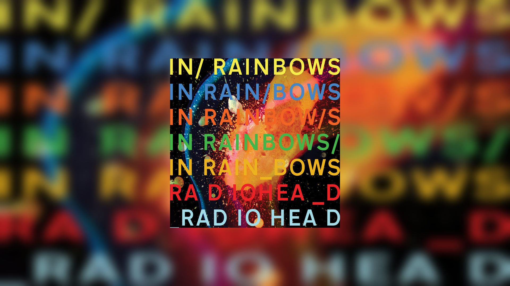

<div align="center">
  <h2> 🎧 Spotify Wallpaper </h2>

  Automatically updates your GNOME wallpaper with the currently playing Spotify album cover.
  <br>
  
  
  
  ---
</div>

## ✨ Features

* 🎵 Syncs wallpaper with Spotify in real time (via MPRIS / DBus)
* 🖼️ Generates a blurred background with centered album art
* 📺 Adapts to your screen resolution automatically
* 🌐 Handles offline mode gracefully
* ⚡ Avoids redundant downloads (same album cover)
* 🧠 Clean logging with useful status messages
* 🛑 Safe exit with `Ctrl+C`

---

<div align="center">
  <h3> 📸 Preview </h3>
</div>

<div align="center">
  
  
</div>

---

## ⚙️ Requirements

* Linux (GNOME desktop)
* Spotify must be **running** and installed via the ***official*** package (Snap versions may block DBus access)
* Python 3.8+

### Python dependencies

```bash
pip install -r requirements.txt
```

---

## 🚀 Usage

```bash
python3 spotify-wallpaper.py
```

That’s it. The wallpaper will automatically update when the track changes.

---

## 📦 Installation
### (This <i><b>will</b></i> depend on whether you use a debian based linux or not)

for debian, you'll add this first:
```bash
sudo apt update
sudo apt install dbus
```
#### then either way you need this:

Clone the repo:

```bash
git clone https://github.com/moi-mimil/spotify-wallpaper.git
cd spotify-wallpaper
```

Install dependencies:

```bash
pip install -r requirements.txt
```

Run:

```bash
python3 spotify-wallpaper.py
```

---

## 🧠 How it works

* Uses **MPRIS (DBus)** to fetch Spotify metadata
* Downloads the current album cover
* Applies a blur + scaling effect using Pillow
* Sets it as the GNOME wallpaper via `gsettings`

---

## ⚠️ Notes

* Works on **GNOME** (uses `gsettings`)
* Requires Spotify to be running
* Internet is needed to fetch album covers (unless cached locally)

---

## 📁 Project Structure

```
.
├── spotify-wallpaper.py
├── requirements.txt
├── README.md
├── LICENSE
├── .gitignore
└── assets/
```

---

## 📜 License

This project is licensed under the MIT License.

---

## 💡 Future ideas

* CLI options (blur strength, update interval, etc.)
* Support for KDE / other desktops
* Packaging as a pip installable tool
* Systemd service integration

---

## 🤝 Contributing

Feel free to open issues or submit pull requests if you have ideas or improvements!

### Made by [me](https://github.com/moi-mimil)

---
